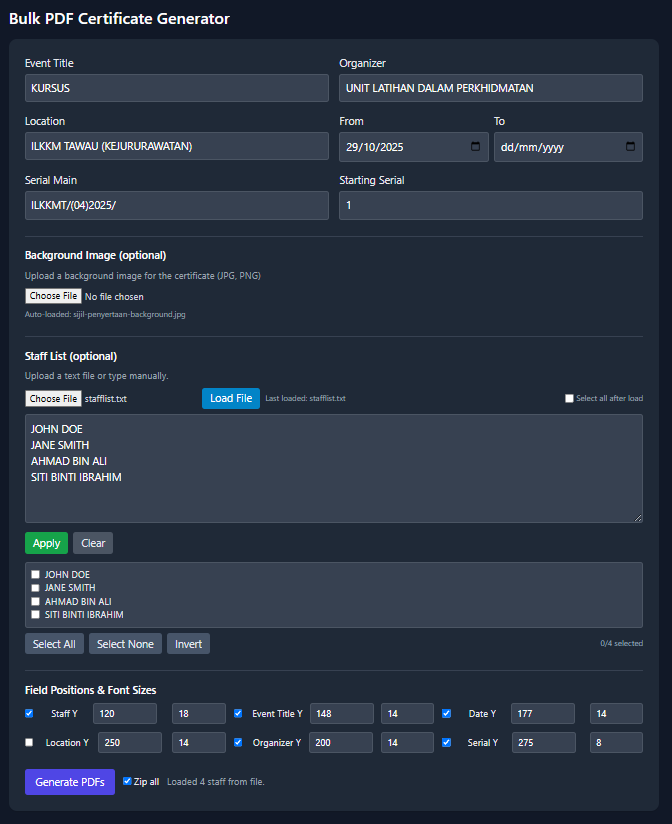

# Bulk PDF Certificate Generator

A web-based application for generating bulk PDF certificates with customizable fields, background images, and automatic staff list loading. Built for organizations that need to create multiple certificates efficiently.


## Features

- 🎨 **Custom Background Images** - Upload certificate templates (JPG/PNG)
- 👥 **Bulk Staff Management** - Upload staff lists from text/CSV files or type manually
- ⚙️ **Customizable Field Positioning** - Adjust Y-position and font size for each field
- 👁️ **Field Visibility Controls** - Show/hide individual fields as needed
- 📅 **Smart Date Formatting** - Automatically formats dates (e.g., "12 - 15 October 2025")
- 📦 **ZIP Export** - Generate all certificates in a single ZIP file
- 🔢 **Auto-incrementing Serial Numbers** - Sequential numbering with custom prefix
- 🌙 **Dark Mode Interface** - Modern, easy-on-the-eyes UI
- 🚀 **Auto-loading** - Automatically loads background and staff list from server folders

## Demo



## Installation

### Basic Setup (Static HTML)

1. Clone the repository:
```bash
git clone https://github.com/yourusername/bulk-pdf-certificate-generator.git
cd bulk-pdf-certificate-generator
```

2. Open `index.html` in a web browser - that's it!

### Apache Server Setup (with Auto-loading)

1. Copy the file to your web server:
```bash
sudo cp index.html /var/www/html/
```

2. Create required folders:
```bash
sudo mkdir /var/www/html/background
sudo mkdir /var/www/html/stafflist
```

3. Add your certificate background image:
```bash
sudo cp certificate.jpg /var/www/html/background/
```

4. Add your staff list:
```bash
sudo cp staff.txt /var/www/html/stafflist/
```

5. Set permissions:
```bash
sudo chmod 755 /var/www/html/background
sudo chmod 755 /var/www/html/stafflist
sudo chmod 644 /var/www/html/background/*
sudo chmod 644 /var/www/html/stafflist/*
```

6. Access via browser:
```
http://your-server-ip/index.html
```

## Usage

### Basic Workflow

1. **Configure Certificate Details**
   - Event Title (default: "KURSUS")
   - Organizer (default: "UNIT LATIHAN DALAM PERKHIDMATAN")
   - Location (default: "ILKKM TAWAU (KEJURURAWATAN)")
   - Date range (From/To)
   - Serial number prefix (default: "ILKKMT/(00)-01-2025/")
   - Starting serial number

2. **Upload Background Image** (optional)
   - Click "Choose File" under Background Image
   - Select your certificate template (JPG/PNG)
   - Auto-loads from `/background/` folder if available

3. **Add Staff Names**
   - **Option A**: Upload a text file with one name per line
   - **Option B**: Type names directly in the textarea (one per line)
   - **Option C**: Auto-loads from `/stafflist/` folder if available
   - Click "Apply" to render the staff list

4. **Select Staff Members**
   - Check/uncheck individuals
   - Use "Select All", "Select None", or "Invert" buttons

5. **Adjust Field Positioning** (optional)
   - Modify Y-position and font size for each field
   - Toggle visibility checkboxes to show/hide fields

6. **Generate Certificates**
   - Check "Zip all" to create a single ZIP file
   - Click "Generate PDFs"
   - Download individual PDFs or ZIP file

### Staff List Format

Create a text file with one name per line:
```
JOHN DOE
JANE SMITH
AHMAD BIN ALI
SITI BINTI IBRAHIM
```

CSV format is also supported (comma-separated):
```
JOHN DOE,JANE SMITH,AHMAD BIN ALI
```

### Default Field Positions

| Field | Y Position | Font Size | Visible by Default |
|-------|-----------|-----------|-------------------|
| Staff Name | 120mm | 18pt | ✓ |
| Event Title | 148mm | 14pt | ✓ |
| Date | 177mm | 14pt | ✓ |
| Organizer | 200mm | 14pt | ✓ |
| Serial Number | 275mm | 8pt | ✓ |
| Location | 250mm | 14pt | ✗ |

## File Naming Convention

### Individual PDFs
```
EventTitle-StaffName.pdf
```
Example: `KURSUS-JOHN_DOE.pdf`

### ZIP File
```
EventTitle-FromDate.zip
```
Example: `KURSUS-2025-10-29.zip`

## Technical Details

### Technologies Used
- HTML5
- CSS (Tailwind CSS via CDN)
- Vanilla JavaScript
- [jsPDF](https://github.com/parallax/jsPDF) - PDF generation
- [JSZip](https://stuk.github.io/jszip/) - ZIP file creation
- [FileSaver.js](https://github.com/eligrey/FileSaver.js/) - File download

### Browser Support
- Chrome/Edge (recommended)
- Firefox
- Safari
- Opera

Modern browsers with ES6+ support required.

### Dependencies (CDN)
All dependencies are loaded via CDN - no npm install needed!

## Configuration

### Auto-loading Behavior

The app automatically searches for files in these locations:

**Background Images** (`/background/` folder):
- `certificate.jpg`
- `certificate.jpeg`
- `certificate.png`
- Or any `.jpg`/`.png` file in the folder

**Staff Lists** (`/stafflist/` folder):
- `staff.txt`
- `stafflist.txt`
- `list.txt`
- Or any `.txt` file in the folder

### Customization

Edit the default values in the HTML file:
```html
<!-- Change default values -->
<input id="eventTitle" value="YOUR EVENT TITLE" />
<input id="organizer" value="YOUR ORGANIZATION" />
<input id="serialMain" value="YOUR-PREFIX/" />
```

## Troubleshooting

### Background image not loading automatically
- Check file permissions: `sudo chmod 644 /var/www/html/background/*`
- Verify file exists: `ls -la /var/www/html/background/`
- Check browser console for errors (F12)

### Staff list not loading automatically
- Ensure file is UTF-8 encoded
- Check for BOM (Byte Order Mark) - the app strips it automatically
- Verify file exists: `ls -la /var/www/html/stafflist/`

### PDF text not aligned correctly
- Adjust Y-position values in "Field Positions & Font Sizes" section
- Test with one certificate first before bulk generation
- A4 page height is 297mm - keep Y values under this

### Date format issues
- Ensure "From" date is filled (defaults to today)
- "To" date is optional
- Same month dates: "12 - 15 October 2025"
- Different months: "12 October 2025 - 15 November 2025"

## Contributing

Contributions are welcome! Please feel free to submit a Pull Request.

1. Fork the repository
2. Create your feature branch (`git checkout -b feature/AmazingFeature`)
3. Commit your changes (`git commit -m 'Add some AmazingFeature'`)
4. Push to the branch (`git push origin feature/AmazingFeature`)
5. Open a Pull Request

## License

This project is licensed under the MIT License - see the [LICENSE](LICENSE) file for details.

## Acknowledgments

- [jsPDF](https://github.com/parallax/jsPDF) for PDF generation
- [JSZip](https://stuk.github.io/jszip/) for ZIP compression
- [Tailwind CSS](https://tailwindcss.com/) for styling
- Institut Latihan Kementerian Kesihatan Malaysia (ILKKM) for the use case

## Support

If you encounter any issues or have questions:
- Open an issue on GitHub
- Check existing issues for solutions
- Review the Troubleshooting section above

---

Made with ❤️ for efficient certificate generation
